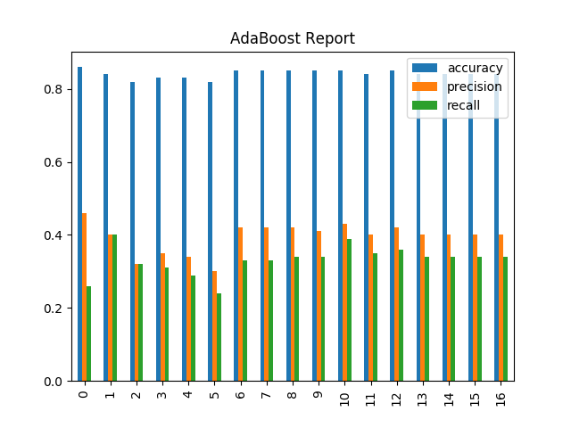
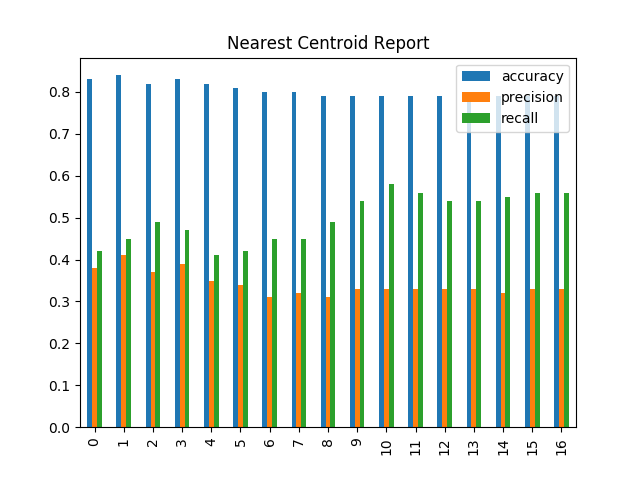

# Enron Data POI classifier

### Summary

The main objective of this exercise was to find the persons of interest in Enron corporate fraud. This makes it a very good candiate for machine learning as we can create classifiers based on machine learning to look for persons of interest in the dataset. The dataset contains a list Enron employees and their financial data, like salary, bonus, stock options etc. The most obvious outlier in the data was the poi "TOTAL", which in fact is the total of the fields and not a person of interest.

# Some interesting characteristics of the dataset:
* There are 146 data points for this dataset
* We have 18  POIs and 128 non-POIs
* There are a total of 17 features that were picked
* A total of 1282 missing values

### Feature Select

For this step I decided to create two aditional fields, namely **to_poi_messages_percent** and **from_poi_messages_percent**. These are the percentage of messages received and sent to pois.

Adding these features increases the precision by 0.004 with no change in recall in case of Nearest Centroid. For Ada boost the precision decreases by 0.07 and the recall increses by 0.01. So, it makes sense to add these features only in case of Nearest Centroid.

To select the number of features, I decide to use SelectKBest with k=11 based on the output graph.

Ada Boost Report:

NearestCentroid Report:

### Algorithm 

The algorithm that I picked was **NearestCentroid** as it had both precision and recall over 0.3, with an accuracy over 0.85. The other algorithm that I tried was AdaBoost, but the NearestCentroid had better overall results.

The feature set in case of **NearestCentroid** was scaled using the **MinMaxScaler** in the default range of (0, 1). This was done so that the algorithm doesn't give missleading results due to the fact that different features have different scales.

### Tuning

Tuning is the process of matching the complexity of the relationships in the data with the complexity of the algorithm. This is the process of figuring out what is the appropriate complexity of the algorithm by testing it with different parameters.

The process that I used to tune the algorithm was using the **GridSearchCV** as it tests out different parameters and returns the best value as per the scoring formulation specified.

In case of **NearestCentroid** I picked the *metric* from 'cosine', 'euclidean', 'l1', 'l2'. And similarly, I picked the *shrink_threshold* as 0.9, 0.7, 0.5.

### Validation

Validation is the process of checking how well the model is trained and to estimate it's properties like: accuracy, prediction and recall.

The main reason behind validation is to check if the classifier has a tendency to overfit and also it give an estimate of the performace on an independent dataset. For cross validation **StratifiedShuffleSplit** was used. This algo first shuffles the data and then splits it into test/train datasets. Also, note that this algorithm preserves the same percentage for each target class as in the complete set.

### Evaluation 

For the evaluation metric, it was focused on the recall and precision. The recall, also know as sensitivity tell us the probablity of selecting the relevant item. Precision tell us for a given entry how many times it guesses it correctly.

In terms of POI, precision will tell us how good our algorithm is at catching POIs. As for recall, it tells us how many of the predicted POIs are actual POIs.